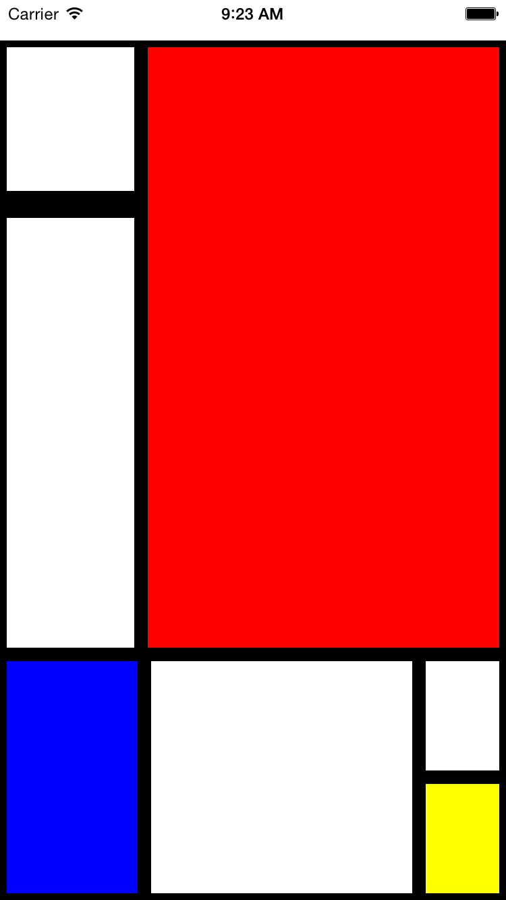

# Welcome!

Hey! If you're reading this, you've probably signed up for my workshop at Strangeloop. Nice.

You **don't** need to clone this repository for the workshop, but this README contains the instructions and the reference solutions.

# Setup

Follow the setup instructions from the [official docs](https://facebook.github.io/react-native/releases/next/docs/getting-started.html).

# Part 1: Components + Styling

## Mondrian

Let's start with some styling practice! Here's a screenshot of what the Mondrian app should end up looking like:

Using flexbox and `<View>` components, try and replicate this in your own application. Remember, you can create a new React Native app with `react-native init APPNAME`.

## Weather app: mockup edition

Next, we're going to focus now on using some basic mobile components from React Native: `<View>`, `<Text>`, `<Image>`, and `<TextInput>`. Here's what my version of the Weather app looks like:

You'll notice the following attributes:

- [ ] Background image
- [ ] Input field
- [ ] Current temperature
- [ ] Location

Try and replicate this in your app, using the above components, as well as appropriate styles. Refer to the docs as necessary.

# Part 2: Interactivity + Platform APIs

## Developer tools

In this exercise you'll also want to make use of the developer tools. Try the following:

- [ ] Open the developer menu from your emulator (iOS or Android)
- [ ] Turn on auto reload and try making some style changes - see what happens!
- [ ] Add a `debugger` statement and open the Chrome developer tools
- [ ] Add a `console.log` statement and view the logged message in the Chrome developer tools (check out the [docs](https://facebook.github.io/react-native/docs/debugging.html) for more ways to view log statements, e.g. `adb logcat` or from Xcode)

## Touch events

- [ ] Make the TextInput interactive! Update the displayed zip code when the user enters text.

## Fetch

- [ ] Use the OpenWeatherMaps API to fetch the weather forecast & update the displayed text accordingly

## Local storage

- [ ] When the user inputs a new zip code, save it to local storage
- [ ] When the app starts, load the previous location from local storage, if available

# Part 3: Cross-platform and Platform-Specific Code

## iOS- and Android-specific code

- [ ] Make a component that renders differently on iOS and Android (different background colors, perhaps?)
- [ ] Using the CutePhotos example as a guide, implement multiple screens in the Weather app, using the appropriate components for iOS and Android, respectively

## Update the weather app

- [ ] Update your app to make the multiple screens actually useful! Display weather forecasts for the previous 5 locations

# Bonus exercises

- [ ] Use the geolocation API to display weather based on the user's current location
- [ ] Provide settings to toggle between Fahrenheit and Celsius
- [ ] Add some animations

